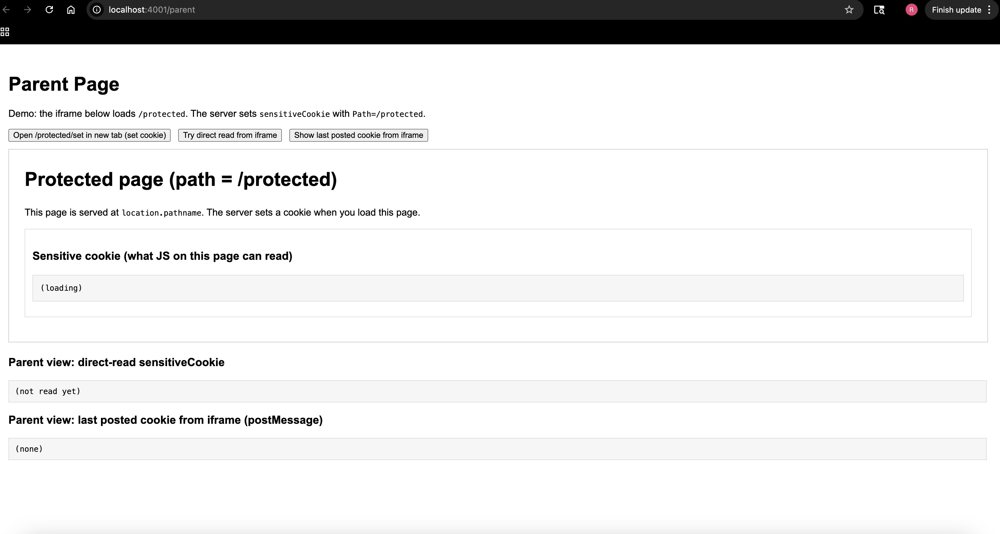
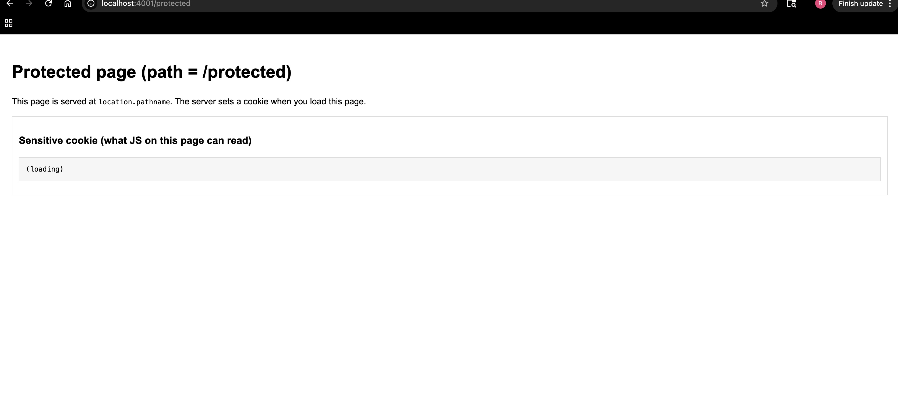

Assignment 4 

### Directories
All work for this assignment is organized under `assignments/BARRETT/4` and separated into these folders and files:
- **framable** - html files that attempt to iframe the assigned public sites (index + 100 test pages)
- **frame-path-attack** - this code demonstrates of showing how `Path` is not sufficient to protect cookies
- **results** - summary demonstrating framing results from 100 sites
- **screenshots** - consist of screenshots showing the parent and protected sites
- **README.md** - contains assignment description, methods, results, and video links

---

### Framable Sites
These websites from my list of 100 that successfully rendered inside an ```<iframe>``` and were not blocked by any browser security headers and CSP policies.
| 1 | vistaprint.com | ✔ Yes | - |
| 2 | sfgate.com | ✔ Yes | - |
| 4 | tripadvisor.com | ✔ Yes | - |
| 7 | nbcnews.com | ✔ Yes | - |
| 9 | ziddu.com | ✔ Yes | - |
| 10 | wikihow.com | ✔ Yes | - |
| 11 | ovh.com | ✔ Yes | - |
| 13 | cbslocal.com | ✔ Yes | - |
| 14 | android.com | ✔ Yes | - |
| 16 | europapress.es | ✔ Yes | - |
| 17 | newsweek.com | ✔ Yes | - |
| 19 | cdc.gov | ✔ Yes | - |
| 20 | narod.ru | ✔ Yes | - |
| 21 | sciencemag.org | ✔ Yes | - |
| 22 | abcnews.go.com | ✔ Yes | - |
| 24 | theguardian.com | ✔ Yes | - |
| 25 | line.me | ✔ Yes | - |
| 26 | thetimes.co.uk | ✔ Yes | - |
| 27 | t-online.de | ✔ Yes | - |
| 28 | cloudflare.com | ✔ Yes | - |
| 32 | howstuffworks.com | ✔ Yes | - |
| 33 | mashable.com | ✔ Yes | - |
| 34 | amazon.com | ✔ Yes | - |
| 35 | histats.com | ✔ Yes | - |
| 36 | rakuten.co.jp | ✔ Yes | - |
| 37 | gofundme.com | ✔ Yes | - |
| 38 | harvard.edu | ✔ Yes | - |
| 39 | change.org | ✔ Yes | - |
| 42 | globo.com | ✔ Yes | - |
| 43 | adobe.com | ✔ Yes | - |
| 46 | ovh.net | ✔ Yes | - |
| 49 | dropbox.com | ✔ Yes | - |
| 51 | goodreads.com | ✔ Yes | - |
| 52 | britannica.com | ✔ Yes | - |
| 53 | photos1.blogger.com | ✔ Yes | - |
| 54 | unesco.org | ✔ Yes | - |
| 56 | g.co | ✔ Yes | - |
| 57 | fandom.com | ✔ Yes | - |
| 58 | yandex.com | ✔ Yes | - |
| 60 | lemonde.fr | ✔ Yes | - |
| 62 | instructables.com | ✔ Yes | - |
| 63 | doi.org | ✔ Yes | - |
| 64 | pinterest.com | ✔ Yes | - |
| 65 | scmp.com | ✔ Yes | - |
| 67 | workspace.google.com | ✔ Yes | - |
| 68 | psychologytoday.com | ✔ Yes | - |
| 69 | nba.com | ✔ Yes | - |
| 71 | wikimedia.org | ✔ Yes | - |
| 74 | pbs.org | ✔ Yes | - |
| 77 | merriam-webster.com | ✔ Yes | - |
| 78 | twitter.com | ✔ Yes | - |
| 79 | jstor.org | ✔ Yes | - |
| 80 | surveymonkey.com | ✔ Yes | - |
| 82 | playstation.com | ✔ Yes | - |
| 85 | salesforce.com | ✔ Yes | - |
| 86 | estadao.com.br | ✔ Yes | - |
| 87 | vk.com | ✔ Yes | - |
| 88 | msn.com | ✔ Yes | - |
| 89 | plesk.com | ✔ Yes | - |
| 91 | get.google.com | ✔ Yes | - |
| 96 | stanford.edu | ✔ Yes | - |
| 98 | spiegel.de | ✔ Yes | - |
| 99 | usatoday.com | ✔ Yes | - |
| 100 | walmart.com | ✔ Yes | - |

### Websites Blocking Framing Using X-Frame-Options
The sites below prevented from being framed by sending an ```X-Frame-Options``` header to either being ```DENY``` or ```SAMEORIGIN```, which stops the browsers from not embedding them in the iframes from external origins.

| 3 | aol.com | ❌ No | X-Frame-Options: DENY |
| 5 | archives.gov | ❌ No | X-Frame-Options: SAMEORIGIN |
| 6 | cpanel.net | ❌ No | X-Frame-Options: SAMEORIGIN |
| 8 | https://ytimg.com | ❌ No | Error: fetch failed |
| 12 | apnews.com | ❌ No | CSP: frame-ancestors 'self' https://cms.apnews.com/ |
| 15 | search.yahoo.com | ❌ No | X-Frame-Options: DENY |
| 18 | webnode.page | ❌ No | X-Frame-Options: DENY |
| 23 | variety.com | ❌ No | CSP: frame-ancestors 'none' |
| 29 | https://ssl-images-amazon.com | ❌ No | Error: fetch failed |
| 30 | cbc.ca | ❌ No | X-Frame-Options: SAMEORIGIN |
| 31 | www.gov.uk | ❌ No | X-Frame-Options: ALLOWALL |
| 40 | google.it | ❌ No | X-Frame-Options: SAMEORIGIN |
| 41 | independent.co.uk | ❌ No | X-Frame-Options: SAMEORIGIN |
| 44 | www.over-blog.com | ❌ No | X-Frame-Options: DENY |
| 45 | stackoverflow.com | ❌ No | X-Frame-Options: SAMEORIGIN |
| 47 | mail.google.com | ❌ No | X-Frame-Options: SAMEORIGIN |
| 48 | buzzfeed.com | ❌ No | X-Frame-Options: SAMEORIGIN |
| 50 | google.co.jp | ❌ No | X-Frame-Options: SAMEORIGIN |
| 55 | translate.google.com | ❌ No | X-Frame-Options: SAMEORIGIN |
| 59 | https://sakura.ne.jp | ❌ No | Error: fetch failed |
| 61 | https://nhk.or.jp | ❌ No | Error: fetch failed |
| 66 | gravatar.com | ❌ No | X-Frame-Options: SAMEORIGIN |
| 70 | discord.com | ❌ No | X-Frame-Options: DENY |
| 72 | gizmodo.com | ❌ No | X-Frame-Options: SAMEORIGIN |
| 73 | https://privacyshield.gov | ❌ No | Error: fetch failed |
| 75 | apache.org | ❌ No | CSP: frame-ancestors 'none' |
| 76 | google.ru | ❌ No | X-Frame-Options: SAMEORIGIN |
| 81 | google.es | ❌ No | X-Frame-Options: SAMEORIGIN |
| 83 | https://amebaownd.com | ❌ No | Error: fetch failed |
| 84 | giphy.com | ❌ No | X-Frame-Options: DENY |
| 90 | google.com.tw | ❌ No | X-Frame-Options: SAMEORIGIN |
| 92 | telegra.ph | ❌ No | X-Frame-Options: SAMEORIGIN |
| 93 | unsplash.com | ❌ No | X-Frame-Options: SAMEORIGIN |
| 94 | goo.gl | ❌ No | X-Frame-Options: SAMEORIGIN |
| 95 | substack.com | ❌ No | CSP: frame-ancestors 'self' https://*.substack.com https://substack.com |
| 97 | weibo.com | ❌ No | X-Frame-Options: SAMEORIGIN |

## Remaining Websites
The following sites had inconsistent framing protections (or mixed results) due to one of the following reasons: sending conflicting ```X-Frame-Options``` and ```Content-Security-Policy``` headers and/or rendering conflicting headers across various subdomains. *I didn't have any websites that fit into this category.*


## Framing Path Attack
Demonstrate how that Path attribute for Cookies is not suitable for security. Demonstrate how a parent page can steal cookies from an iframed page if only the Path attribute is used in Set-Cookie.

# Screenshots
Parent SC


Protected SC



# *Scripts / Commands used**
- Generate the test pages:
```bash
# from assignments/BARRETT/4
node ./generate.js ..\3\sites.txt ..\3\responses .\framable

Youtube Link
Frameable Sites: https://youtu.be/2Na8aVV46Bc
Frame-path Sites: https://youtu.be/YQ6vgLJwLR4 
