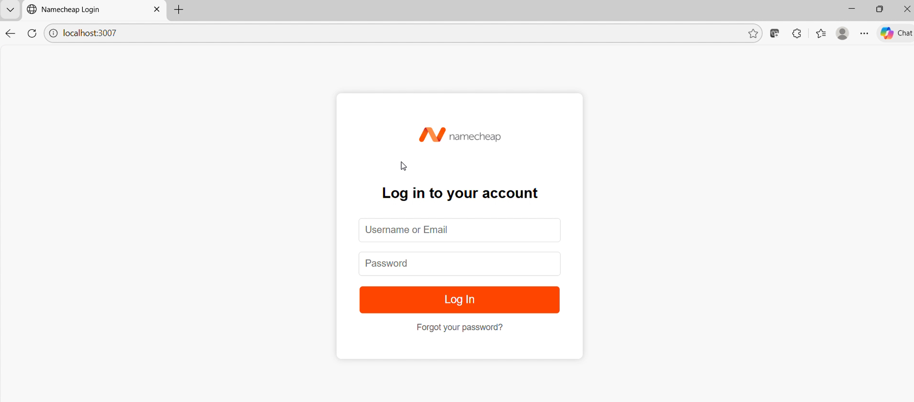
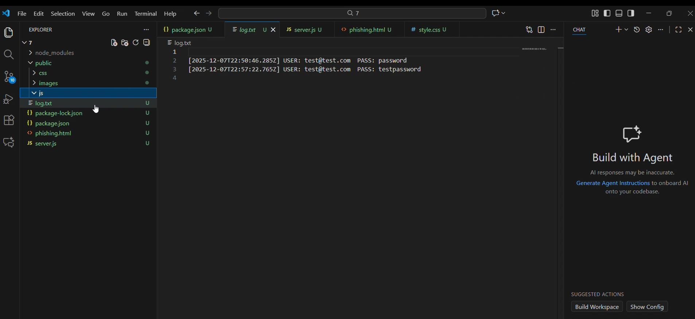
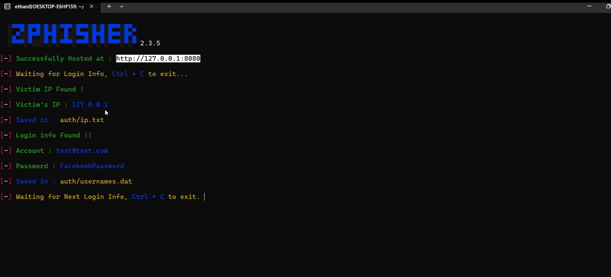
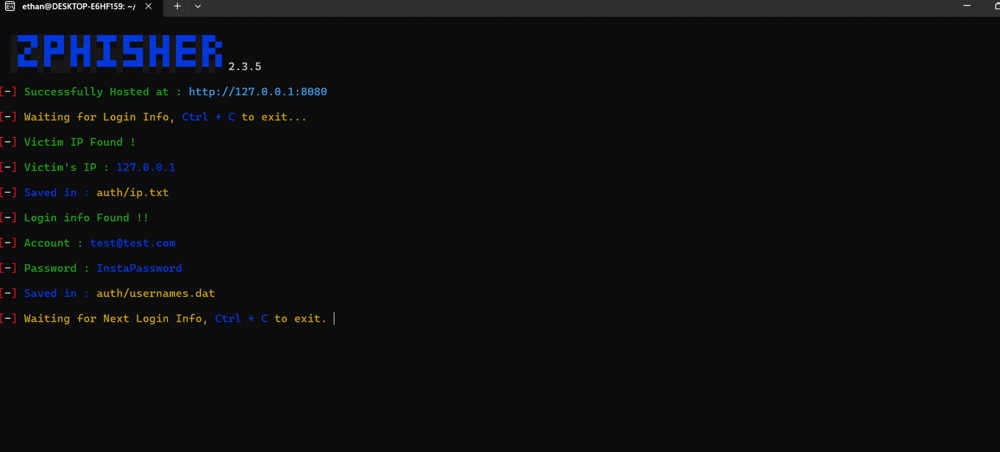

# Assignment 7 – Phishing Site Deployment

---

## Overview
This project involves deploying a simple phishing-style website on a local Express.js server and demonstrating the site in action. The extra credit portion includes installing and running Zphisher inside a WSL/Ubuntu environment.

Both demonstrations show:
- The phishing page loading in a browser
- Dummy credentials being entered
- Logging of those credentials on the server

---

## Issues Encountered
While completing the assignment, I ran into a few challenges:

### **Regular Assignment**
1. **package.json JSON error**  
   I accidentally forgot a comma after `"type": "module"` which caused an `EJSONPARSE` error.  
   Fix: Ensure commas are correctly placed between all JSON fields.

### **Extra Credit (Zphisher)**
1. **WSL had no Linux distro**  
   Running `wsl` originally gave an error:  

## Screenshots

### **1. Phishing Site Displayed in Browser (Regular Assignment)**

*The main phishing page successfully rendered from my local Express.js server.*

### **2. Harvested Credentials Log (Regular Assignment)**

*Shows dummy usernames and passwords being captured and logged.*

---

### **3. Extra Credit – Zphisher Pages**

*Zphisher Facebook template page running on Ubuntu inside WSL.*

*Zphisher Instagram template page running on Ubuntu inside WSL.*

*Zphisher Twitch template page running on Ubuntu inside WSL.*
---

## Demo Videos

### **Regular Assignment Demonstration**
🔗 https://youtu.be/vc6KV6GPxLw

### **Extra Credit Demonstration**
🔗 https://youtu.be/EDBgBPk5nZ4

---

## Notes
This assignment demonstrates:
- Running a simple Express.js phishing-like server
- Logging POST submission data
- Accessing the server from other devices on the network
- Running a phishing template tool (Zphisher) inside WSL/Ubuntu
>>>>>>> 342e1e8 (Assignment 7 Submission)

