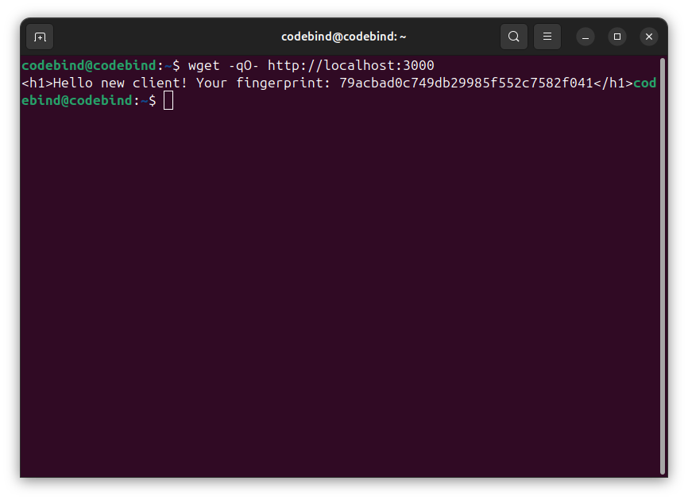
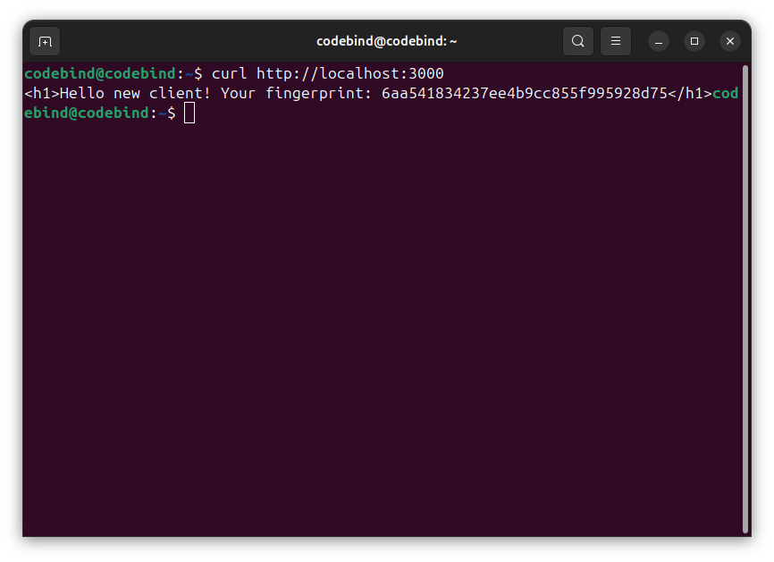
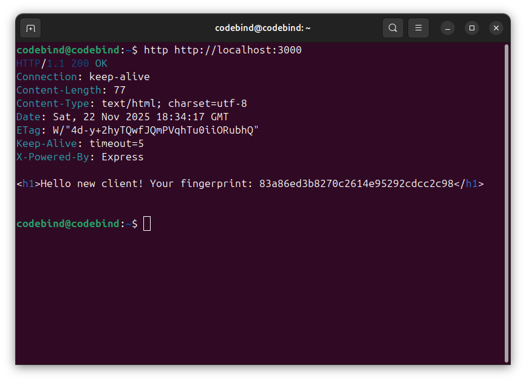
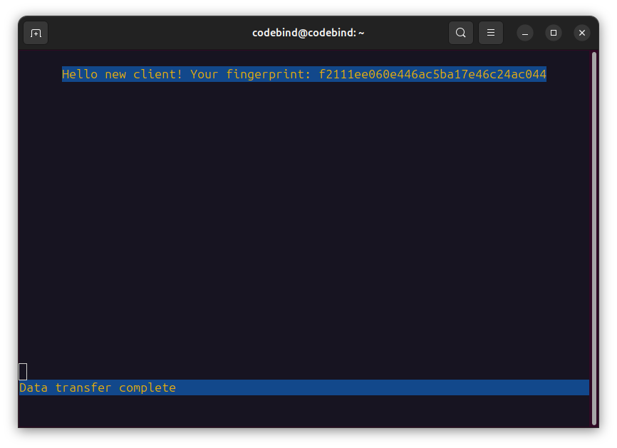

# Assignment 6 — Browser Fingerprinting  
**CS 433/533 Web Security, Fall 2025**  
**Due:** 2025-11-23  

All code and files for this assignment are located in directory `6/`.

## Project Contents
```
6/
├── server.js
├── package.json
├── README.md
├── log.txt
└── screenshots/
```
## Links to the Code

- **server.js** — Express server implementing browser fingerprinting  
  https://github.com/DmnAnt/assignments/Mcfarlane/6/server.js  

- **log.txt** — Server-generated fingerprints  
  https://github.com/DmnAnt/assignments/Mcfarlane/6/log.txt  

## Short Description of the Fingerprinting Algorithm

The server fingerprints each client by collecting a combination of HTTP request headers and hashing them with **MD5** to generate a unique, repeatable identifier.

The following headers are used:

- `User-Agent`
- `Accept-Language`
- `Accept-Encoding`
- `DNT` (or fallback blank value)
- (Additional headers from clients such as curl / wget / httpie)

### **Algorithm Steps**
1. Extract the selected HTTP headers from the incoming request.  
2. Concatenate these header values into a single fingerprint string.  
3. Pass the string to the **md5()** hashing function to generate a 32-character fingerprint.  
4. Log the following to `log.txt`:
   - Timestamp  
   - Fingerprint  
   - Full request headers (including User-Agent)  
5. Check previous fingerprints to recognize returning clients.

This fingerprint is stable for a specific client configuration but differs across browsers, tools, or devices.

## Screenshot of 6+ Fingerprints

The screenshots below shows the fingerprint log from six different clients:







