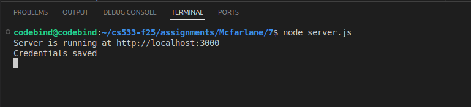
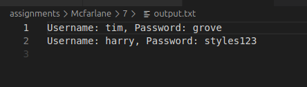

# Phishing Site Demonstration - Assignment 7

This project demonstrates a simple phishing-style website used for educational and cybersecurity learning purposes.  
The site displays a fake login page (rendered from `index.html`) and sends captured credentials to a backend Node.js server (`server.js`), which stores the harvested data in `output.txt`.

⚠️ **This project is strictly for academic use.**


## Directory Structure

```
7/
│── index.html
│── server.js
│── output.txt (generated after form submission)
```

## How the Phishing Site Works

1. User opens the phishing “login” page served by `server.js`.
2. The page displays a cloned login interface.
3. When the victim enters username/password and clicks **Login**, the form sends POST data to:
```
/save
```
4. The backend writes the credentials to `output.txt`.
5. The server then redirects the user back to `/`.

## Running the Project

1. Install dependencies
```bash
npm install express body-parser
```
2. Start the server
```bash
node server.js
```
3. Open in browser
```
http://localhost:3000
```

## Issues encountered

1. The cloned page originally contained many references to official JavaScript files, such as:
```
<script src="//assets-cdn.abcnews.com/abcnews/.../client/abcnews/5426-71e7842a.js" defer></script>

```
These external scripts caused:

- CORS failures
- Blocking errors
- Page not rendering

So I commented out all such remote scripts and API calls.

## Screenshots

1. Login Page Loaded in Browser


2. Credentials input in login form


3. Credentials saved in log file after submission



4. Log file



## Demonstration Video

👉 [Watch the video on YouTube](https://youtu.be/ukEE4p6WZho)