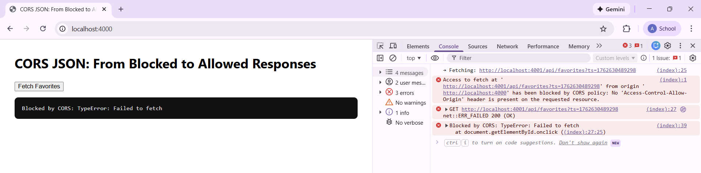
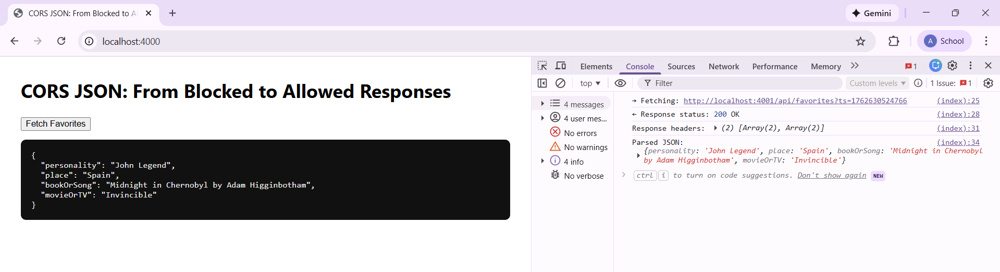
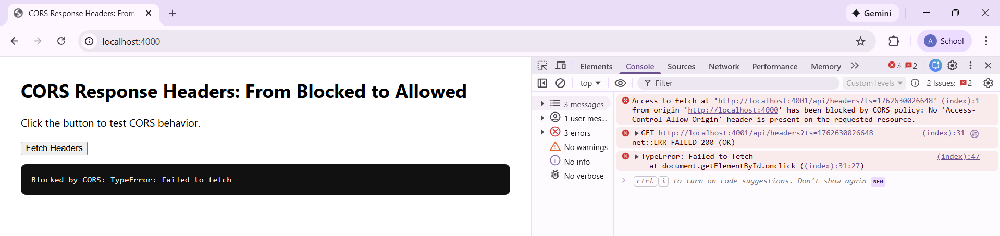
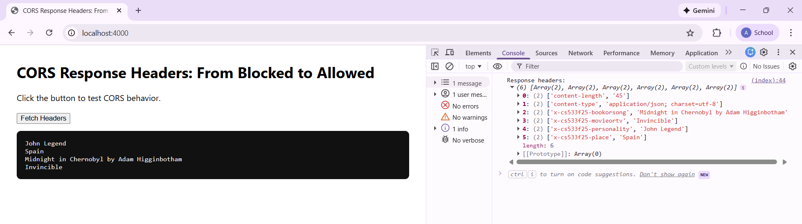
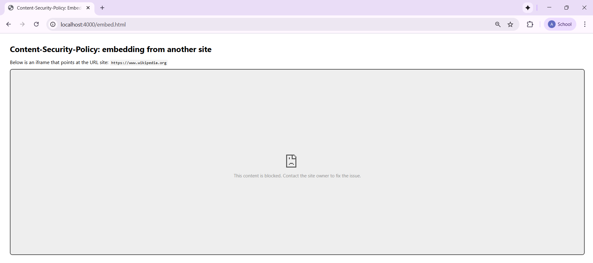
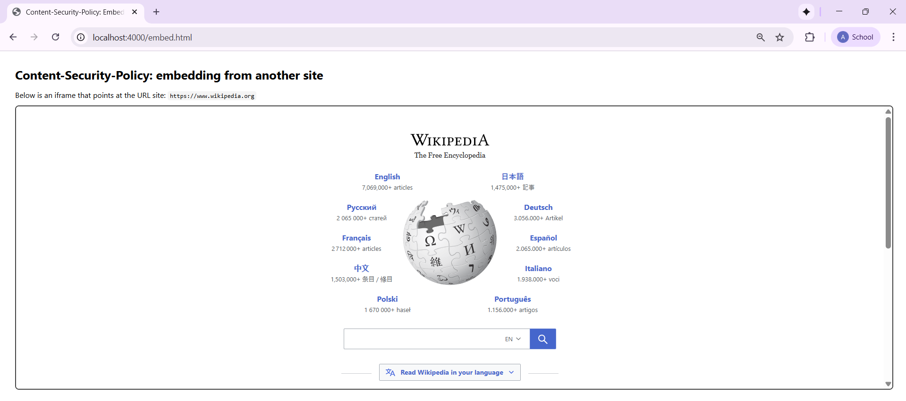

# Assignment 5 Submission

### Directories
All work for this assignment is organized under `assignments/Wright/5` and separated into these folders and files:
- **5.1** - Demonstrates how browsers block and allow cross-origin JSON requests depending on the server configuration.  
- **5.2** - Tests how browsers handle and expose custom HTTP response headers using CORS.  
- **5.3** - Shows how Content-Security-Policy (CSP) determines whether a remote site can be embedded within an iframe.  
- **README.md** - Contains descriptions, explanations, video links, and screenshots for each part of the assignment.  

---

### 5.1 - CORS JSON: From Blocked to Allowed Responses
This part of the assignment demonstrates how browsers enforce the Same-Origin Policy when trying to fetch JSON data from another origin.  
At first, the request is blocked because the server does not permit cross-origin access. After enabling the correct response headers, the JSON data is displayed successfully.

- The first screenshot shows the **blocked request**, where the console indicates that the response has been stopped by the browser’s CORS policy.  
  

- The second screenshot shows the **allowed request**, where the data loads successfully once CORS is configured.  
  

---

### 5.2 - CORS Response Headers: From Blocked to Allowed
This section demonstrates how CORS affects the visibility of custom response headers.  
When headers are not explicitly exposed, the browser hides them to prevent data leaks. Once configured properly, the headers become visible, showing how CORS policies can safely expand browser access to trusted data.

- The first screenshot shows the **blocked state**, where custom headers such as `X-CS533F25-Personality`, `X-CS533F25-Place`, `X-CS533F25-BookOrStrong`, and `X-CS533F25-MovieOrTv` are hidden.  
  

- The second screenshot shows the **allowed state**, where all exposed headers are now visible and readable by the browser. 
  

---

### 5.3 - Content-Security-Policy: Embedding from Another Site
This part shows how the CSP header determines whether a remote website can be displayed inside an iframe.  
When the policy restricts embedding, the page is blocked. Once the policy is updated to allow the external source, the iframe loads the page correctly.

- The first screenshot shows the **blocked version**, where the CSP policy prevents the external site from loading in the frame.  
  

- The second screenshot shows the **allowed version**, where the Wikipedia page successfully loads inside the iframe once the CSP policy allows it.  
  

---

### Youtube Video Overview
* CORS: Blocking and reading responses from another origins (5.1): [https://youtu.be/TcWYnvGnTgw](https://youtu.be/TcWYnvGnTgw)
* CORS: Blocking and reading HTTP response headers from another origin (5.2): [https://youtu.be/kDiFyA0i5M4](https://youtu.be/kDiFyA0i5M4)
* Content-Security-Policy: embedding from another site (5.3): [https://youtu.be/JfHv_ZhxTpI](https://youtu.be/JfHv_ZhxTpI)