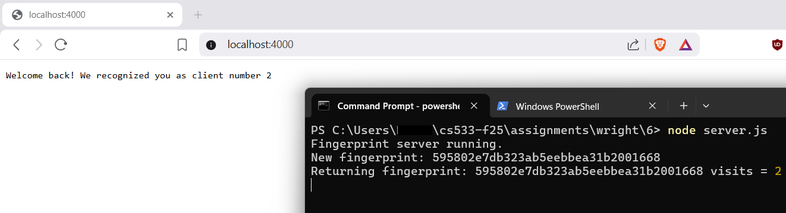
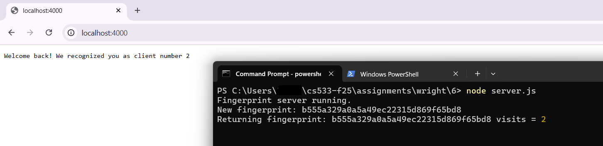
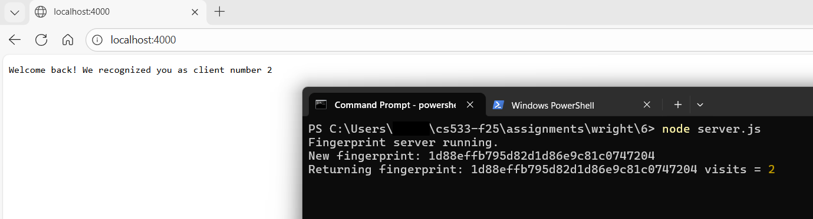
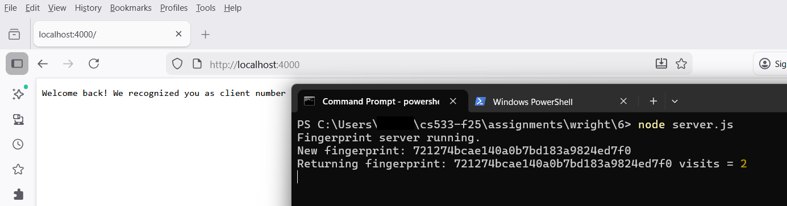
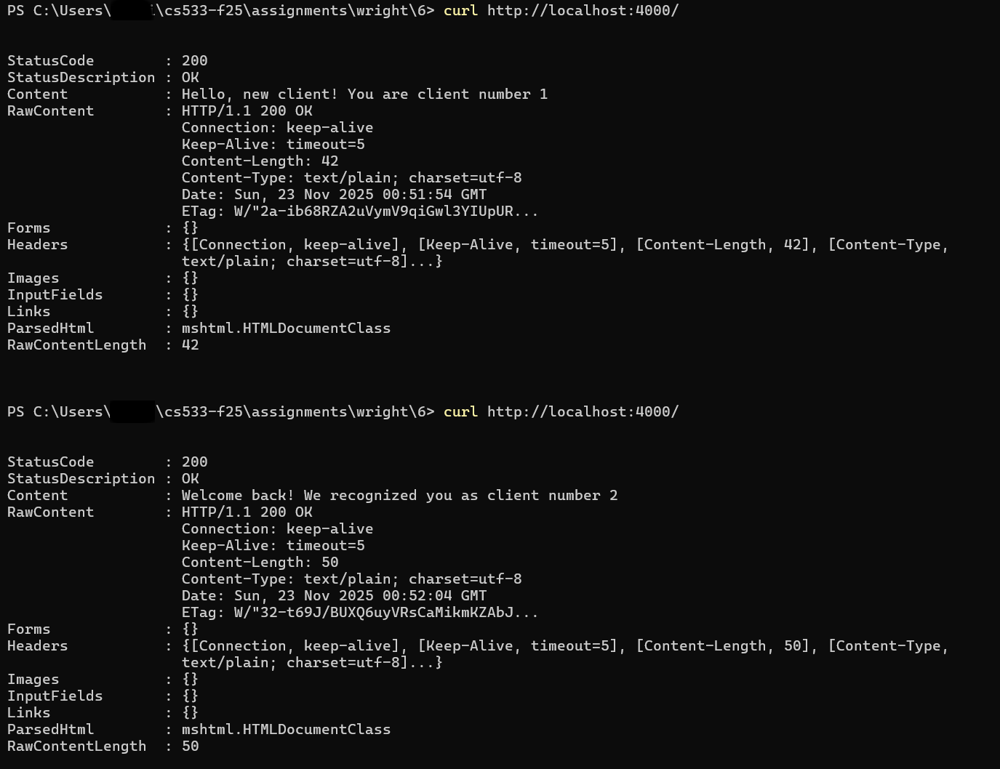
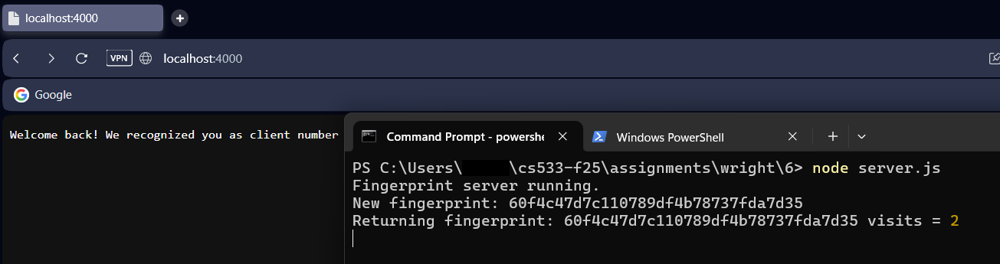

# Assignment 6 Submission

### Directories
All work for this assignment is organized under `assignments/Wright/5`.
- `server.js` – Express server that generates and tracks browser fingerprints.
- `server.log` – Server-side log file that records each fingerprint and visit count.
- `README.md` – This file, describing the fingerprinting algorithm, setup, screenshots, and video link.

---

## Fingerprinting Algorithm
This assignment uses **HTTP request headers + an MD5 hash** to create a fingerprint for each browser or device that connects to the server. :contentReference[oaicite:3]{index=3}  

### Headers used
The server combines these four headers from each incoming request:

- `User-Agent`
- `Accept-Language`
- `Accept-Encoding`
- `Accept`

These values are read with `req.get(...)`, joined into a single string, and then passed into the `md5` function. The result is a hexadecimal hash that serves as the browser’s **fingerprint**.

---

### Screenshots
Fingerprint From Brave:  
  

Fingerprint From Google Chrome:  

Fingerprint From Microsoft Edge:  

Fingerprint From Mozilla Firefox:  

Fingerprint From Curl (PowerShell request):  

Fingerprint From Opera Browser:  

---

### Youtube Video Overview
Assignment 6: Browser Fingerprinting Demo: [https://youtu.be/g49MxGs6GdU](https://youtu.be/g49MxGs6GdU)
