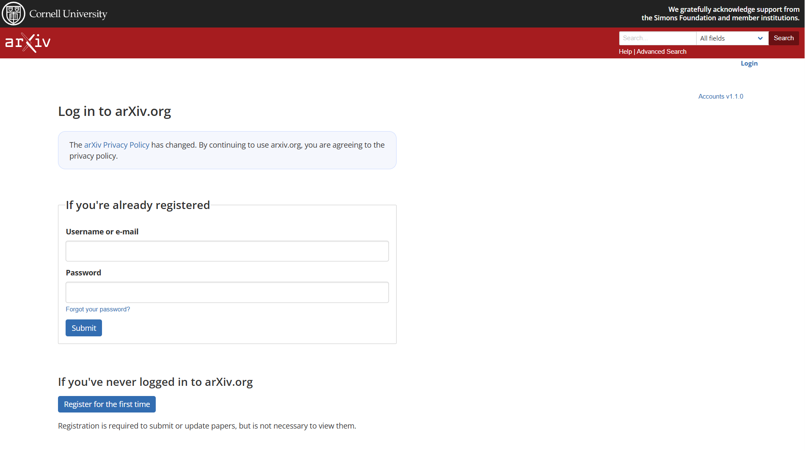
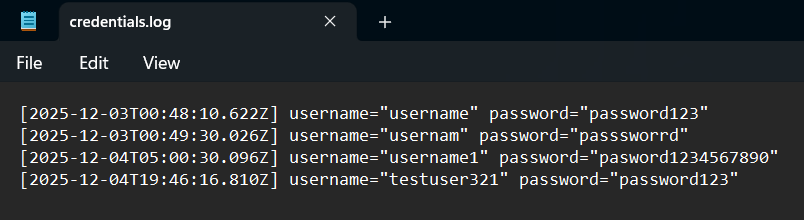

# Assignment 7 Submission

### Directories
All work for this assignment is organized under `assignments/Wright/7`.
- `server.js` – node.js server that serves the phishing page,
- `public` - directory containing all static files for the cloned arXiv login page, including the HTML, CSS, and images used to recreate the interface.
- `screenshots` - contains all the screenshots
- `README.md` – This file describes the phishing page setup, how to run the server, screenshots, and a video link.

---

## Setup Explanation

Using one of my 100 websites, I chose to recreate the ``https://arxiv.org/login`` and implement a phishing-style clone. I modified the HTML so that any submitted credentials are captured on my server.

---

## Running the Server

To start the phishing server, run:

```bash
node server.js
```

Then visit:
```
http://localhost:4000
```

---

### Screenshots
- The Actual arXiv Login Page for Comparison


- My Local Phishing Website  
  

- Logged Credentials  


---

### Short Discussion

Recreating the arXiv login page locally required solving several display and loading problems. The page did not display correctly at first because the styling, images, and other resources used by the real site rely on external files that do not load when the page is run on a local server. As a result, many components appeared broken or incomplete until those resource paths were replaced with local equivalents.    
I also reorganized everything into a single ``public/`` directory so that ``server.js`` could serve the resources correctly. The layout rendered incorrectly at first because the login and registration sections blended together, and the spacing and alignment did not match the real page.  
The logos also failed to load until I saved the proper ``.svg`` versions and replaced the earlier image files. After correcting the paths, fixing the CSS selectors, and removing conflicting browser defaults, the page displayed correctly and exactly matched the appearance of the real arXiv login interface. 

---

### Youtube Video Overview

Assignment 7 - Phishing Login Page Demo: [https://youtu.be/zt3BKYwanww](https://youtu.be/zt3BKYwanww)