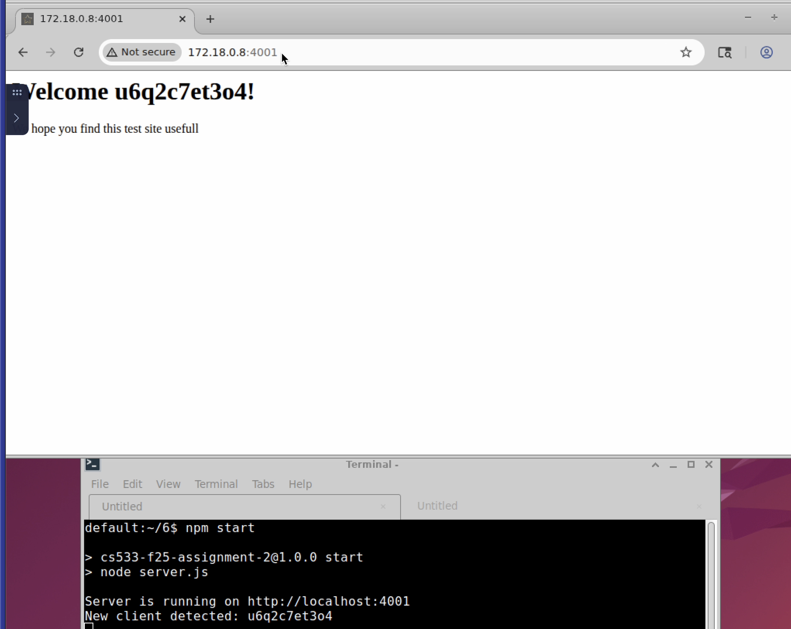
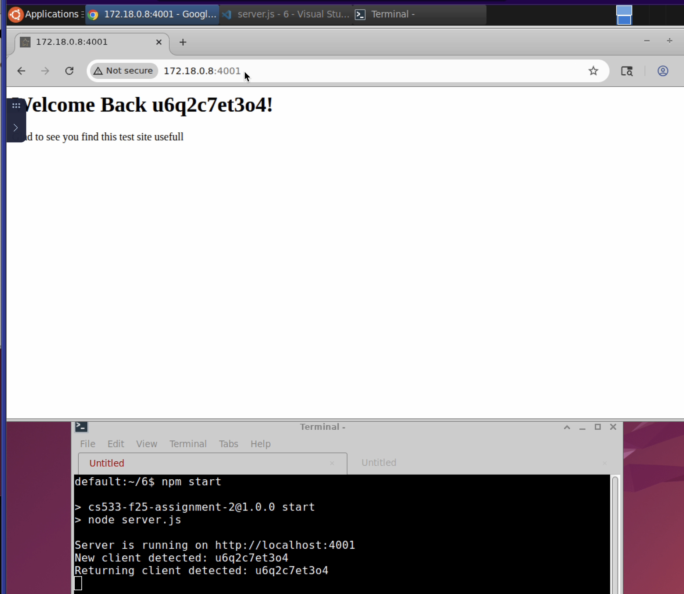

CS 533 Rodwin Spruel Assignment 6:
===================================

# Overview
### To run the servers, you just need to navigate to the folder where the server.js file is stored and run `npm start`
#### If node modules have not been installed you should run 'npm install' prior to running 'npm start'

### Client fingerprinting:
This assigment focuses on fingerprinting clients that connect to the expressjs server. The main headers entry used for fingerprinting include:
- User-Agent
- Accept-Language
- Accept-Encoding
- Geolocation

When a client connects to the server, these fields are compared to clients that are currently known by the server. If all the fileds match an existing client the connection is mapped to that client. If there is no match, then a new client entry is added to the server's internal list. 

As the response is generated by the server and the client is identefied, the ID associated with the client is added to the html page that is returned to the client. This helps makes the html page unique to each client. 

[server file](server.js)

-----------------

## Example Images
Here's an example of a new client connecting to the server:

Here's an example of a know client connecting to the server:

-----------------

## Youtube Video

To view the script running you can check out the following video on YouTube: https://youtu.be/8lKTuHt3r0Q
