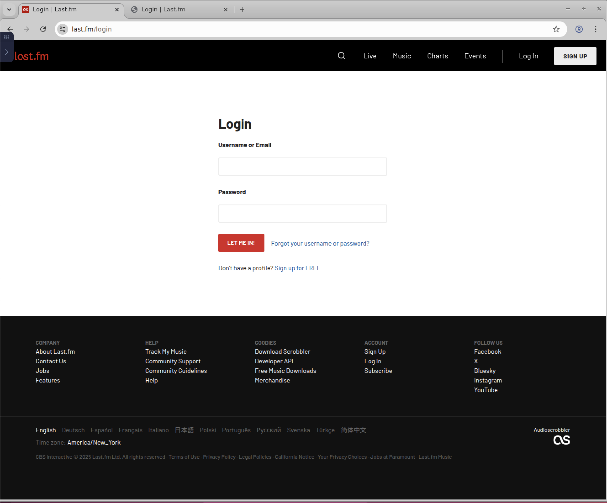
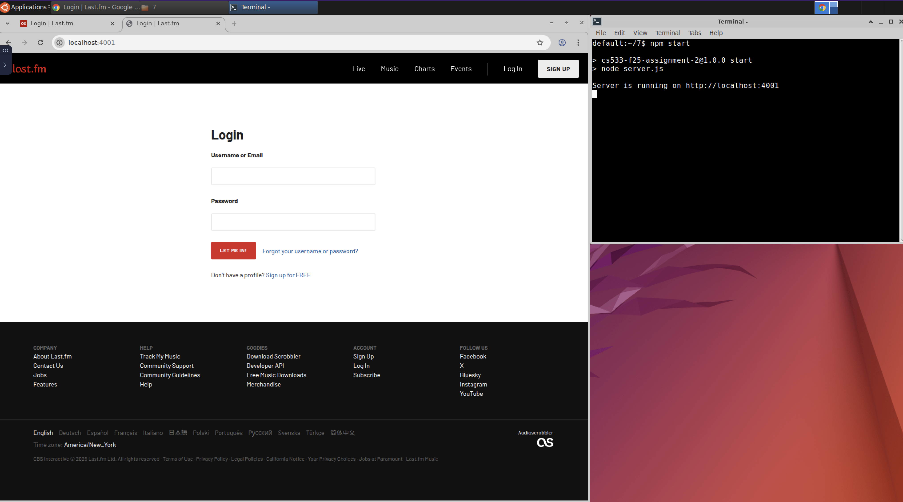
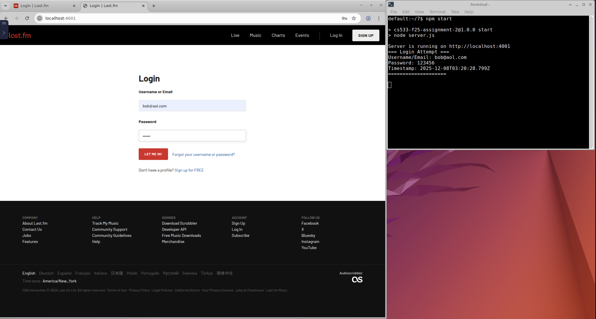

CS 533 Rodwin Spruel Assignment 7:
===================================

# Overview
### To run the servers, you just need to navigate to the folder where the server.js file is stored and run `npm start`
#### If node modules have not been installed you should run 'npm install' prior to running 'npm start'

### Phishing Page of last.fm Login Page:
This assigment focuses on creating a server that issues a phishing login page that mimics last.fm's login page. 
When the use clicks the login button the crdentials are sent back to the local server and printed out to the console. 
[server file](server.js)
,[phishing page](pages/index.html)

-----------------

## Example Images
Here's the original last.fm login page:

Here's the phishing login page:

Here's the console output after user tries to login:

-----------------

## Youtube Video

To view the script running, you can check out the following video on YouTube: https://youtu.be/JTKOlZGSTnE
