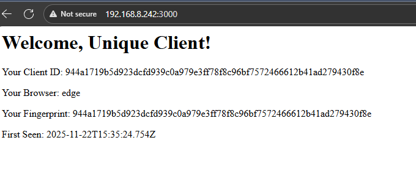
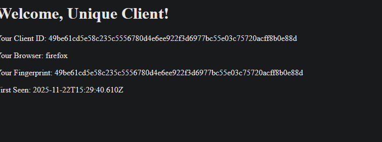
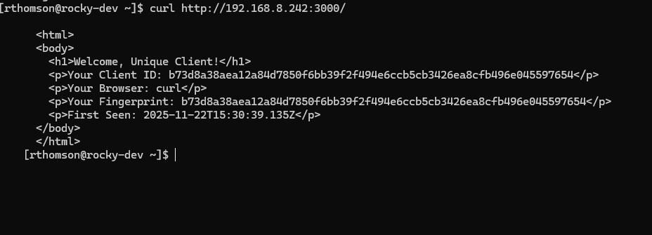
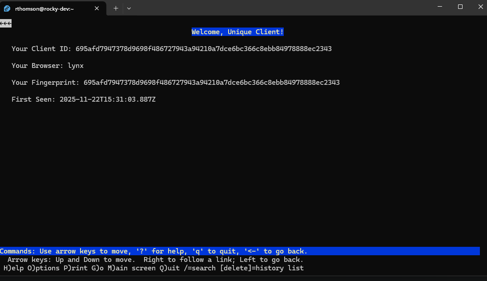
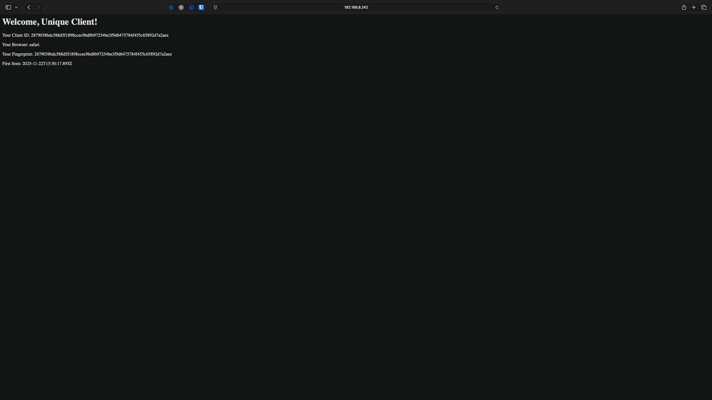

# Assignment 6

## Client Fingerprinting
```
|--6
    |--node_modules           #Contains Node modules for Node Express and CORS
    |--client-pages           #Unique Client Webpages for each fingerprint
    |--fingerprints.json      #JSON Document containing each finger print and client in place of a Database
    |--package-lock.json      #NPM Lock File
    |--package.json           #NPM Package Manifest
    |--server.js              #Javascript for hosting the server backend and client fingerprint logic
```

## How to Run
1. node server.js
2. Vist webpage with unique clients to see diffrent webpages based off fingerprints!

## Tested Clients
 - Windows | Firefox
 - Windows | Chrome
 - Windows | Edge
 - IOS | Safari
 - OSX | Safari
 - UNIX | Lynx
 - UNIX | Curl

## How do we fingerprint?
We hash the following aspects into a sha-256, which we then use to see if you have visted the site before and route you to a unique webpage for your client.
- User Agent
- Request Headers
- Encoding Headers
- Language Headers
- IP address

[Video Demo](https://youtu.be/K6NluoDCGRc)

## Screenshots
### Chrome-Windows

### Edge-Windows

### Firefox-Windows

### Curl-UNIX

### Lynx-UNIX

### Safari-OSX
